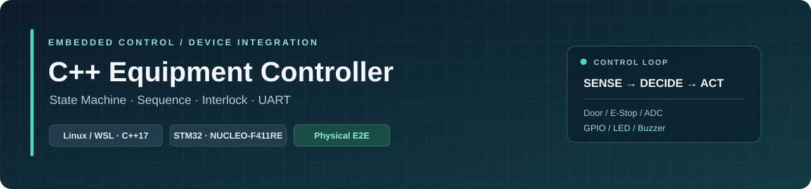
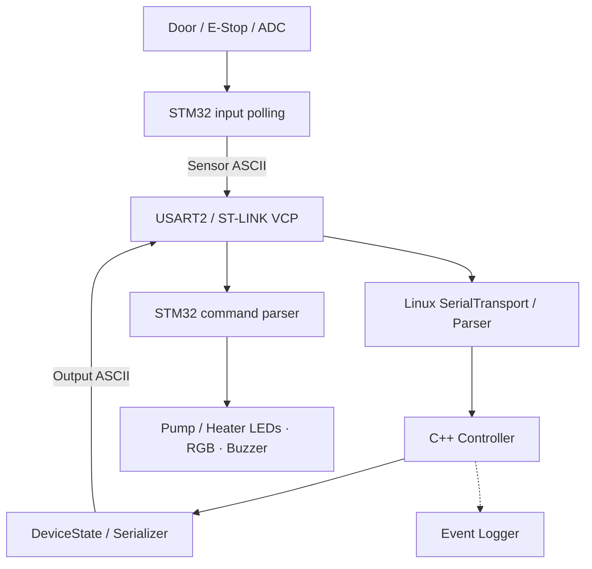
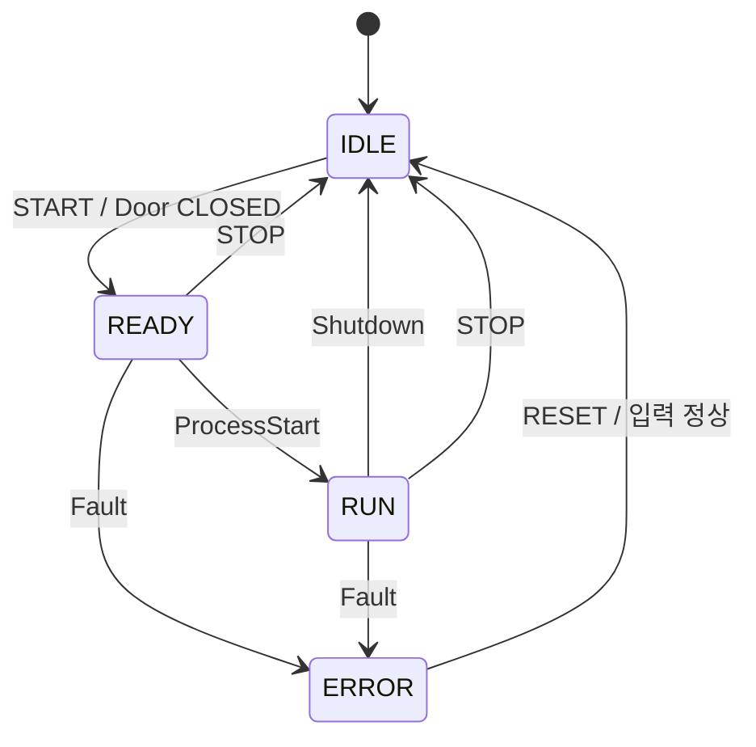

<p align="center">
  
</p>

<p align="center">
  
  
  
  
  
</p>

<p align="center">
  <a href="#validation">Validation</a> · <a href="#demo">Demo</a> · <a href="#architecture">Architecture</a> · <a href="#state--sequence">State / Sequence</a> · <a href="#interlock--fault">Interlock / Fault</a> · <a href="#build">Build</a>
</p>

# C++ Equipment Controller

**STM32의 스위치·ADC 입력을 UART로 받아 공정 상태와 인터록을 판단하고, 장비 출력을 제어하는 C++17 Controller입니다.**

Linux / WSL에서 State Machine, Sequence, Alarm과 출력 상태를 관리합니다. STM32는 Door·E-Stop·ADC 입력을 수집하고, Controller가 보낸 명령을 GPIO 출력에 적용합니다. 펌프·히터 출력은 LED로 구성했으며, RGB LED와 부저로 RUN / ERROR 상태를 표시합니다.

## Development History

| 날짜 | 개발 내용 |
|---|---|
| [2026.10.08](https://github.com/triton0305/cpp-equipment-controller/commit/d369655de6b2da80c92cd9a169ade65186b3e674) | C++ Controller · State / Sequence 기본 구조 구현 |
| [2026.10.08](https://github.com/triton0305/cpp-equipment-controller/commit/6b640ed0ec78b2ad4020e49d216e301dfe1198f9) | 6종 Fault · STOP / RESET · 이벤트 로그와 경계 조건 검증 |
| [2026.10.08](https://github.com/triton0305/cpp-equipment-controller/commit/b93b98a83d8d6dee2b5defad78a64c64d2c497e4) | ASCII Protocol · Linux Serial Transport · 모듈 분리와 CTest 30개 구성 |
| [2026.10.08](https://github.com/triton0305/cpp-equipment-controller/commit/0a73996ebc61e2a2eb3ec9452e8117a59274a897) | STM32 GPIO / ADC / UART Runtime 연동 · Host 검증 4개 추가 |
| [2026.10.08](https://github.com/triton0305/cpp-equipment-controller/commit/c5d6953605a620da03defa46681c7e653f1c9e39) | 실제 보드 Flash / Boot / I/O · Door Fault / RUN 중 E-Stop E2E 검증 기록 |

## Validation

NUCLEO-F411RE와 WSL을 연결해 **실제 입력 → STM32 → UART → C++ Controller → UART → GPIO 출력** 경로를 검증했습니다. 아래 결과는 2026.10.08 검증 기록 기준입니다.

| 검증 범위 | 확인 항목 | 결과 |
|---|---|:---:|
| Controller | 정상 Sequence · 6종 Fault · STOP / RESET · 안전 출력 · 반복 Fault | PASS |
| Protocol / Transport | ASCII 파싱·직렬화 · 분할 수신 · 긴 입력 복구 · PTY 연결 해제·재연결 | PASS |
| Runtime / Logging | UART 실행·종료 · Console / File Logger · 이벤트 내용·순서·횟수 | PASS |
| Build / 자동 테스트 | Linux / STM32 Build · Controller / Protocol / Transport / STM32 Host | **34/34 PASS** |
| Board / I/O | Flash readback · Boot · USART2 양방향 · GPIO · Door / E-Stop · ADC | **HW VERIFIED** |
| Door Fault E2E | 실제 Door 변화 → Controller 판단 → UART 명령 → GPIO 출력 | **HW VERIFIED** |
| RUN-state E-Stop E2E | 실제 E-Stop → RUN에서 ERROR 전환 → 펌프·히터 OFF / 빨강·부저 ON | **HW VERIFIED** |

<details>
<summary><strong>자동 테스트 · 실물 검증 · 트러블슈팅 상세</strong></summary>

### 자동 테스트

| 테스트 | 검증 내용 |
|---|---|
| TEST_1–15 | START Door Interlock · 정상 Sequence · Door / Pressure / Temperature / Motor / E-Stop / Communication Fault · RESET · STOP · Logger · 경계 조건 |
| TEST_16–19 | 센서 파싱 · DeviceState 직렬화 · 비정상 ASCII 메시지 14개 거부 |
| TEST_20–26 | 포트 열기·닫기 · PTY TX/RX · 분할 수신 · 긴 line 복구 · peer disconnect · 동일 객체 재연결 |
| TEST_27–28 | 실제 실행 파일 + PTY · 센서 5개 / 출력 30줄 · 정상 종료와 exit code 0 |
| TEST_29 | 파일 로그의 Level · 이벤트 내용 · 순서 · 기록 횟수 |
| TEST_30 | 6종 Fault와 RESET 후 Valve CLOSED |
| STM32_ADC_HOST | 실제 ADC C 코드 + HAL Fake · raw 값 · timeout · tick rollover · HAL 오류 |
| STM32_PROTOCOL_CONTRACT | Linux 출력 64조합 · 실제 Linux 파서와 STM32 직렬화 호환 · 분할 / CRLF / 비정상 입력 |
| STM32_RUNTIME_HOST | 실제 Runtime / GPIO C 코드 + HAL Fake · RX/TX · backpressure · ADC 오류 · Door / E-Stop / 저압 Fault 연동 |
| STM32_UART_ADAPTER_HOST | USART2 레지스터 접근 분기 검증 |

C++ verifier는 테스트 프로세스의 stdout / stderr를 수집하고, TEST 번호별 결과를 기준 출력과 비교합니다. Timestamp 정규화, timeout, non-blocking pipe 처리와 child 종료·회수를 포함합니다.

### 실제 보드 검증

| 항목 | 확인 결과 |
|---|---|
| 연결 | WSL usbipd → ST-LINK/V2.1 → NUCLEO-F411RE · VCP `/dev/ttyACM0` |
| Flash | 19,476-byte binary와 SWD Flash readback 일치 |
| Boot | 전원 재연결 후 DOOR / ESTOP / PRESSURE telemetry 지속 수신 |
| GPIO | Pump / Heater / Buzzer / RUN / ERROR 각각 ON·OFF · **10/10 pin checks** |
| Door | PB0 입력 HIGH / LOW와 OPEN / CLOSED telemetry 일치 |
| E-Stop | 실제 스위치 조작으로 OFF → ON → OFF → ON 확인 |
| ADC | 가변저항 조작으로 **0–4095** · 중간 값 · 입력 구간에서 **175종 raw 값** |
| Door Fault E2E | Linux 명령과 GPIO ODR / IDR **296/296 snapshots** 일치 |
| RUN 중 E-Stop E2E | RUN → ERROR · EmergencyStop alarm=5 · Fault 구간 **15 snapshots** 일치 |
| 실물 관찰 | 펌프·히터 LED OFF · 초록 OFF · 빨강 ON · 부저음 ON |
| 시험 종료 | 명시적 all-off 명령 후 GPIO 출력 0 · Stepper PC0–PC3 LOW |

GPIO 검증은 MCU의 ODR / IDR readback과 사용자의 LED·부저 관찰을 사용했습니다. ADC 검증값은 12-bit raw count입니다.

실물 E2E harness는 기존 Controller / Protocol / Transport 라이브러리에 연결해 START / RESET API와 `update()`를 호출했습니다. RUN 중 E-Stop 시험은 관찰 구간 확보를 위해 3초 간격으로 공정을 진행하고, E-Stop 활성화와 Door 열림을 즉시 전달했습니다. 온도·모터 입력은 Controller 기본값을 사용했습니다. 시험 종료 시 3초 관찰 후 all-off 명령으로 정리했습니다.

### 트러블슈팅

**E-Stop 조건식 수정** — 활성화 조건을 `sensor_state_.emergency_stop`으로 정리하고, RUN 중 입력 발생 시 EmergencyStop Alarm과 안전 출력 전환을 회귀 테스트로 확인했습니다.

**UART peer disconnect 감지** — PTY peer 종료 후 포트가 열린 상태로 남는 현상을 재현했습니다. `poll()`의 HUP / ERR / NVAL을 확인해 포트를 닫도록 수정하고, 동일 Transport 객체를 다시 열어 수신을 확인했습니다.

**분할 수신과 긴 입력 복구** — UART의 여러 read에 걸친 line을 버퍼로 조합하고, 길이 제한을 넘는 line은 다음 LF까지 폐기합니다. 이후 정상 메시지 수신을 테스트했습니다.

**WSL USB 재연결** — 보드 전원 재연결 후 usbipd attach로 ST-LINK / VCP 접근을 복구하고, telemetry와 GPIO 명령 적용을 확인했습니다.

**E-Stop 입력 재확인** — 초기 입력 HIGH 고정 이후 실제 스위치를 조작해 OFF / ON 변화를 재확인하고, RUN 중 E-Stop E2E 시험까지 완료했습니다.

**시작 구간 framing** — 포트 개방 구간에서 불완전한 line을 거부하고 이후 정상 telemetry를 수신했습니다. 시작 구간 framing 안정화는 후속 검증 항목으로 관리합니다.

검증 근거와 시험 조건은 [Hardware Verification](firmware/stm32-equipment-io/HARDWARE_VERIFICATION.md) · [STM32 Runtime](firmware/stm32-equipment-io/RUNTIME.md)에 정리했습니다.

</details>

## Demo

**RUN 중 E-Stop 동작**

> Demo GIF · 부저음 포함 영상 추가 예정

<!-- Demo GIF를 docs/assets/estop-demo.gif에 추가한 뒤 아래 HTML 주석을 해제합니다.
<p align="center">
  
</p>
-->

<!-- 부저음을 포함한 영상 링크를 추가합니다.
<p align="center"><a href="VIDEO_URL">부저음을 포함한 E-Stop 동작 영상</a></p>
-->

| 입력 전 · RUN | 실제 입력 | 입력 후 · ERROR |
|:---:|:---:|:---:|
| 초록 ON · 펌프 / 히터 LED ON | **E-Stop 누름** | 초록 OFF · 펌프 / 히터 LED OFF · 빨강 / 부저 ON |

## Key Features

| 영역 | 구현 내용 |
|---|---|
| **Controller** | EquipmentState / SequenceStep 분리 · START / STOP / RESET |
| **Interlock / Alarm** | Door · Pressure · Temperature · Motor · E-Stop · Communication Fault |
| **Output** | Pump / Heater / Valve 상태 · RUN / ERROR LED · Buzzer · Fault 안전 출력 |
| **Protocol** | LF 기반 ASCII 센서 파싱 · 출력 직렬화 · Linux ↔ STM32 호환 |
| **Transport** | Linux termios · 115200 8N1 · non-blocking RX · 분할 line 조합 · 포트 재개방 |
| **STM32 Runtime** | GPIO · 협력형 ADC polling · USART2 RX/TX · 100 ms sensor report |
| **Verification** | CTest 34개 · HAL Fake 기반 실제 Firmware C 코드 테스트 · 실물 E2E |
| **Logging** | INFO / WARNING / ERROR · Console / File · Controller 이벤트 기록 |

## Architecture



| Component | Responsibility |
|---|---|
| **Linux C++ Controller** | 센서 상태 · 공정 진행 · 인터록 검사 · Alarm · 출력 상태 결정 |
| **ASCII Protocol / SerialTransport** | 센서 line 파싱 · 출력 직렬화 · UART 송수신 |
| **STM32 Device I/O** | 실제 입력 읽기 · ADC 값 수집 · 명령별 GPIO 출력 |
| **Logger** | 연결된 Controller의 START / STOP / FAULT / RESET 이벤트 기록 |
| **Test Harness** | START / RESET 요청 · 공정 호출 주기 · 입력·명령·GPIO 관측 |

## State / Sequence

`EquipmentState`는 장비 전체 상태, `SequenceStep`은 공정 절차를 나타냅니다.



| 순서 | SequenceStep | 동작 |
|:---:|---|---|
| 1 | CheckDoor | 인터록 검사 후 PumpOn으로 진행 |
| 2 | PumpOn | 펌프 ON |
| 3 | CheckPressure | 인터록 검사 후 HeaterOn으로 진행 |
| 4 | HeaterOn | 히터 ON |
| 5 | CheckTemperature | 인터록 검사 후 ProcessStart로 진행 |
| 6 | ProcessStart | RUN 진입 · 초록 ON |
| 7 | ProcessRunning | ProcessComplete로 진행 |
| 8 | ProcessComplete | Shutdown으로 진행 |
| 9 | Shutdown | 펌프 / 히터 OFF · Valve CLOSED · 초록 OFF · IDLE 복귀 |

`update()`는 인터록을 먼저 검사하고, 정상 상태에서 Sequence를 한 단계 진행합니다. 공정 진행 속도는 호출 주기에 따릅니다.

<details>
<summary><strong>Command 처리와 실행 입력 기준</strong></summary>

| Command | 처리 조건 | 결과 |
|---|---|---|
| START | IDLE · Door CLOSED | READY / CheckDoor |
| STOP | READY 또는 RUN | 출력 정지 · Sequence 정리 · IDLE |
| RESET | ERROR · 모든 Fault 입력 정상 | Alarm / Sequence / 출력 초기화 · IDLE |

START 시 Door가 열려 있으면 IDLE을 유지합니다. RESET은 Door CLOSED, E-Stop OFF, Motor 정상, Communication 정상, 온도 ≤80°C, 압력 ≥50 조건에서 처리합니다. RUN 중 RESET과 ERROR 중 STOP은 현재 상태를 유지합니다.

Controller 기본 입력은 온도 25°C, 압력 60, Door CLOSED, E-Stop OFF, Motor 정상, Communication 정상입니다. 수신된 센서 line마다 해당 필드를 갱신합니다. 실물 STM32는 Door / E-Stop / ADC를 보고하며, 온도·모터 입력 연동은 후속 범위에 정리했습니다.

현재 Sequence의 CheckPressure / CheckTemperature는 공통 인터록 검사를 거쳐 다음 단계로 진행합니다. 시간 기반 공정 유지와 목표 온도 도달 조건은 후속 공정 정책에 포함합니다.

</details>

## Interlock / Fault

READY / RUN에서 매 `update()`마다 인터록을 확인합니다. 아래 표는 검사 우선순위입니다.

| 순서 | Alarm | 발생 조건 |
|:---:|---|---|
| 1 | EmergencyStop | E-Stop 활성화 |
| 2 | CommunicationFault | `communication_ok == false` |
| 3 | DoorOpen | Door OPEN |
| 4 | MotorFault | `motor_fault == true` |
| 5 | OverTemperature | 온도 >80°C |
| 6 | PressureFault | 펌프 ON · 압력 <50 |

Fault 발생 시 **Sequence 정리 → ERROR → 안전 출력 적용**으로 전환합니다.

| 출력 | RUN | Fault / ERROR | RESET / 초기화 |
|---|:---:|:---:|:---:|
| Pump / Heater | ON | OFF | OFF |
| Valve | CLOSED | CLOSED | CLOSED |
| RUN green | ON | OFF | OFF |
| ERROR red | OFF | ON | OFF |
| Buzzer | OFF | ON | OFF |

ERROR의 Alarm·빨강·부저는 Fault 원인 해소 후 RESET이 처리될 때까지 유지됩니다. 압력의 현재 입력 단위는 ADC raw count이며 Controller 기준값은 50입니다.

## Hardware

| 구성 | 장비 / 역할 |
|---|---|
| MCU Board | **NUCLEO-F411RE · STM32F411RET6** |
| Debug / USB Serial | ST-LINK/V2.1 · Virtual COM Port |
| Host | Linux / WSL · usbipd USB passthrough |
| 입력 | Door / E-Stop 스위치 · B10K 가변저항 |
| 출력 | Pump / Heater LED · RGB 상태 LED · 부저 |
| UART | USART2 · 115200 baud · 8N1 |

<details>
<summary><strong>Pin · Clock · Firmware 동작 기준</strong></summary>

| 신호 | Pin | 동작 |
|---|---|---|
| Pressure ADC | PA0 / ADC1_IN0 | 12-bit raw · 0–4095 |
| USART2 TX / RX | PA2 / PA3 | ST-LINK VCP |
| Door | PB0 | Pull-up · LOW = CLOSED |
| E-Stop | PB1 | Pull-up · LOW = ON |
| Pump LED | PB7 | HIGH = ON |
| Heater LED | PA6 | HIGH = ON |
| Buzzer | PA7 | HIGH = ON |
| ERROR red / RUN green | PB4 / PB5 | HIGH = ON |
| RGB blue | PB6 | GPIO 설정 · 상태 색상 연동은 후속 범위 |
| DHT11 data | PC4 | GPIO 설정 · 센서 Driver 연동은 후속 범위 |
| Stepper IN1–IN4 | PC0–PC3 | GPIO 설정 · 초기화 LOW · 구동 연동은 후속 범위 |

| Clock / Timer | 설정 |
|---|---|
| Clock Source | HSI 16 MHz → PLL |
| SYSCLK / HCLK | 84 MHz |
| APB1 / APB1 Timer | 42 MHz / 84 MHz |
| APB2 | 84 MHz |
| TIM5 | Prescaler 83 · 1 MHz · 1 tick = 1 µs |
| 빌드 메모리 기록 | FLASH 19,476 B / 512 KB · RAM 2,144 B / 128 KB |

STM32는 foreground loop에서 ADC와 USART2를 polling합니다. 센서 보고는 이전 packet 송신 완료 후 100 ms 간격으로 예약하며, 각 poll에서 RX / TX를 최대 32 byte씩 처리합니다. ADC conversion timeout은 10 ms입니다.

UART RX / TX는 USART2 SR / DR 레지스터 접근을 사용합니다. CubeMX의 Pin / Clock / Peripheral 설정은 생성 프로젝트에 보관하고, Runtime 호출은 `main.c`의 USER CODE 영역에 배치했습니다.

초기화는 펌프·히터·부저·RGB·Stepper 출력을 모두 OFF로 설정합니다. Linux 출력 명령을 받은 뒤 해당 GPIO를 갱신합니다.

</details>

## Build

### Linux Controller

- C++17 compiler / C compiler
- CMake 3.16 이상
- Linux termios / PTY 환경

```bash
cmake -S . -B build -DCMAKE_BUILD_TYPE=Debug
cmake --build build -j2
ctest --test-dir build --output-on-failure
```

### UART Run

```bash
./build/apps/controller/equipment_controller /dev/ttyACM0
```

현재 실행 파일은 **10초 동안 센서 line을 수신하고 Controller 출력 상태를 전송**합니다. START / STOP / RESET은 Controller API로 제공하며, 자동 테스트와 실물 E2E harness에서 호출합니다.

<details>
<summary><strong>STM32 Build · 실행 연결 · 개발 도구</strong></summary>

STM32 빌드에는 CMake 3.22 이상, Ninja, Arm GNU Toolchain이 필요합니다.

```bash
cd firmware/stm32-equipment-io
cmake --preset Debug
cmake --build --preset Debug
```

빌드 결과 ELF는 `firmware/stm32-equipment-io/build/Debug/stm32-equipment-io.elf`에 생성됩니다. Flash / SWD 접근은 ST-LINK를 사용합니다.

WSL에서는 usbipd로 보드를 연결한 뒤 `lsusb`와 `/dev/ttyACM0`을 확인합니다. 전원 재연결 후에는 USB attach 상태를 확인합니다.

루트와 STM32 빌드는 `compile_commands.json`을 생성합니다. VS Code / clangd에서 해당 빌드 경로를 지정해 소스 탐색에 사용할 수 있습니다.

</details>

## ASCII Protocol

모든 메시지는 `KEY:VALUE\n` 형식입니다.

| 방향 | 메시지 | 적용 |
|---|---|---|
| STM32 → Linux | `DOOR:CLOSED` / `DOOR:OPEN` | Door 상태 |
| STM32 → Linux | `ESTOP:ON` / `ESTOP:OFF` | E-Stop 상태 |
| STM32 → Linux | `PRESSURE:<integer>` | ADC raw 값 |
| Linux → STM32 | `PUMP:ON/OFF` · `HEATER:ON/OFF` | LED 출력 |
| Linux → STM32 | `BUZZER:ON/OFF` | 부저 |
| Linux → STM32 | `RUN_LED:ON/OFF` · `ERROR_LED:ON/OFF` | RGB green / red |
| Linux → STM32 | `VALVE:OPEN/CLOSED` | 명령 인식 · 수신 횟수 기록 · 구동 매핑 후속 연동 |

표의 slash는 선택 가능한 값을 나타냅니다.

<details>
<summary><strong>센서·출력 예시와 수신 처리</strong></summary>

센서 packet 예시:

```text
DOOR:CLOSED
ESTOP:OFF
PRESSURE:1820
```

EmergencyStop 출력 예시:

```text
PUMP:OFF
HEATER:OFF
VALVE:CLOSED
BUZZER:ON
RUN_LED:OFF
ERROR_LED:ON
```

Linux 파서는 `TEMP:<number>`, `MOTOR:OK/FAULT`도 지원합니다. STM32의 현재 보고 필드는 Door / E-Stop / Pressure입니다.

Linux는 LF까지 수신한 line을 조합하고 CRLF를 처리합니다. STM32는 최대 31-character line을 조합하며, 긴 입력·binary·RX 오류 line은 다음 LF까지 폐기합니다. 완성된 유효 명령을 GPIO에 적용합니다.

센서 필드와 출력은 line 단위로 처리합니다. ADC 오류 시 Pressure 보고를 생략하며, Linux는 해당 필드의 최근 값을 유지합니다. `io_runtime_rx_errors`와 `io_runtime_unsupported_valve_commands`는 debugger 관측용 counter입니다.

</details>

## Scope

현재 검증 범위는 **Controller 공정·Fault 로직, Protocol / Transport, STM32 Door·E-Stop·ADC·GPIO와 실제 Door / E-Stop 기능 E2E**입니다. 펌프·히터 제어는 LED 출력으로 관찰했습니다.

<details>
<summary><strong>후속 구현·검증 범위</strong></summary>

| 영역 | 후속 작업 |
|---|---|
| Operator Runtime | START / STOP / RESET 입력 경로 · 지속 실행 |
| Process Policy | 시간 기반 공정 유지 · 목표 온도 도달 조건 |
| Sensor / Display | DHT11 Driver와 실제 온도 입력 · Motor 입력 연동 · OLED 표시 |
| Actuator | Stepper 회전 · Valve 위치 / 방향 매핑 |
| Indicator | RGB IDLE / READY 색상 연동 |
| Pressure | ADC raw → 압력 단위 보정 · threshold 정합 |
| Communication | 실제 cable loss 대응 · 자동 재연결 · heartbeat / stale-data 정책 · MCU timeout 안전 출력 |
| Startup | 포트 개방 구간 framing 안정화 |
| Timing | E-Stop 입력부터 실제 출력까지 정량 측정 · 응답시간 기준 검증 |

통신상실 안전 출력과 자동 복구는 후속 정책·구현·실물 검증 범위입니다. 현재 STM32는 마지막으로 적용한 출력 명령을 유지합니다. Controller의 CommunicationFault 경로와 Transport 재개방 기능은 Host 테스트로 검증했습니다.

E-Stop의 현재 실물 결과는 **기능 E2E 검증**이며, 호출 주기와 실제 응답시간은 시험 조건 및 후속 측정 항목으로 관리합니다.

</details>

## Project Structure

<details>
<summary><strong>소스 디렉터리와 책임</strong></summary>

| 경로 | 역할 |
|---|---|
| `apps/controller/` | Linux UART 실행 파일 |
| `modules/core/` | State / Sequence · Command · SensorState / DeviceState · Interlock / Alarm |
| `modules/protocol/` | ASCII 센서 파서 · 출력 직렬화 |
| `modules/transport/` | Linux SerialTransport |
| `modules/logging/` | Console / File Logger |
| `firmware/stm32-equipment-io/App/` | GPIO · ADC · UART · ASCII · Foreground Runtime |
| `firmware/stm32-equipment-io/Core/` | CubeMX 생성 초기화 · Runtime 진입 |
| `firmware/stm32-equipment-io/stm32-equipment-io.ioc` | Pin / Clock / Peripheral 설정 |
| `tests/` | Controller / Protocol / Transport / Logging / Firmware Host 검증 |
| `docs/assets/` | README 헤더 · Demo asset 추가 위치 |

</details>

## Verification Records

| 문서 | 내용 |
|---|---|
| [Hardware Verification](firmware/stm32-equipment-io/HARDWARE_VERIFICATION.md) | 실제 보드 연결·입력·출력·E2E 시험 조건과 결과 |
| [STM32 Runtime](firmware/stm32-equipment-io/RUNTIME.md) | 구현 범위 · UART contract · Host 테스트 · 빌드 기록 |
